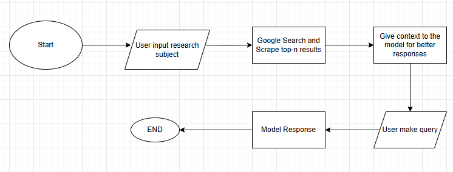

# About
PseudoGPT (WebScraperGPT) is an application that allow lower model of OpenAI to gain access of up-to-date data by using WebScraper to perform a google search regarding to provided topic then feed those context to the LLM ultimately gave the model access to the internet.

# Features
- Give context via Top-n page Google Search then provide k-chunk of result for the model to make better responses.
- Can Specify Model role
- Can Specify Model Response Behavior (can make assumption or not)

# Output

# Flowchart
